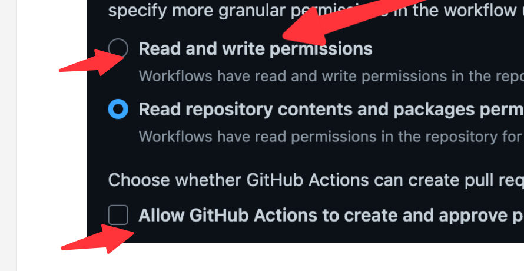

[English](README_en_US.md)

## 模板用法

1. Use Template

2. Clone 到本地

3. 建立开发软链接

    - 创建 dev 目录
    - 运行 `scripts/make_dev_link.py` 脚本，传入的参数为 plugins 目录的绝对路径，比如

        ```powershell
        ❯❯❯ sudo python .\scripts\make_dev_link.py H:\临时文件夹\SiYuanDevSpace\data\plugins
        已存在同名文件夹，退出
        ```

    - 可能需要 sudo 运行，我自己在 windows 上通过 scoop 安装了 sudo 可以直接这么运行，普通 windows 用户可以首先以管理员身份打开命令行，然后运行。
    - 由于生成的软链接和 plugin name 相同，所以不要把工程目录放在 plugins 下（这一点和官方的模板相反）

4. 开发

    - 开启 pnpm dev 模式后，自动跟踪代码和 i18n README plugin.json，编译结果放在 dev 目录下
    - 新版思源已经允许使用软链接，所以无需把项目放在 plugin 下，思源就可以读取到 dev 目录下的改变

5. 手动发布「也可以选择自动发布」

    - pnpm build, 自动生成 package.zip


## 使用 Github action 自动发布

自带了 github action，可以自动打包发布，请遵循以下操作：

1. 设置项目 `https://github.com/OWNER/REPO/settings/actions` 页面向下划到 **Workflow Permissions**，打开配置

    

2. 需要发布版本的时候，push 一个格式为 `v*` 的 tag，github 就会自动打包发布 realse（包括 package.zip）

3. 默认使用保守测量进行 pre-release 发布，如果觉得没有必要，更改 release.yml 的设置：

    ```yaml
    - name: Release
        uses: ncipollo/release-action@v1
        with:
            allowUpdates: true
            artifactErrorsFailBuild: true
            artifacts: 'package.zip'
            token: ${{ secrets.GITHUB_TOKEN }}
            prerelease: true # 把这个改为 false
    ```


## 依赖

本项目修改自 [terwer/siyuan-plugin-importer](https://github.com/terwer/siyuan-plugin-importer)

